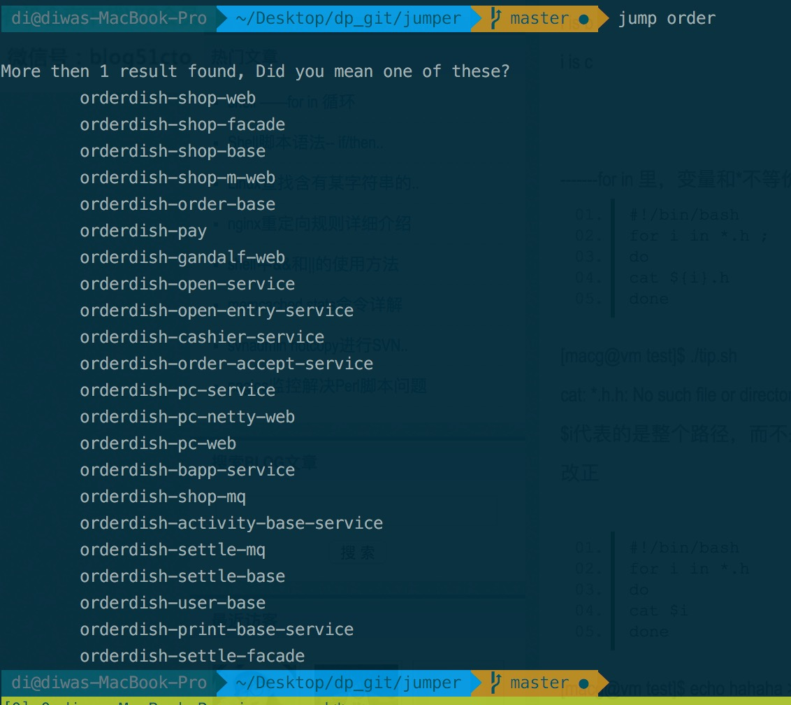

# jumper

### CURRENT VERSION : ``v2.0``

## WHAT IS JUMPER

```
快速登录beta环境机器的shell

你可以使用 jump ${app_name} , 直接登录对应app的beta机器
```

## GETTING START

* 获取源码

```
git clone git@code.dianpingoa.com:orderdish/jumper.git

```

* 进入源码路径

```
cd jumper
```

* 初始化

```
source ./init.sh
```

Then, ``enjoy it!`` :)

## HOW TO USE

比如, 你要登录beta环境的Ecom(orderdish-shop-web)

只需要

```
jump orderdish-shop-web
```
or

```
j orderdish-shop-web
```

## FAQ

* 如果我的app没有出现在该命令中或者原有的app对应的beta 机器发生了变更我该怎么办?

```
jumper的基础app信息都存储在$JUMPER_HOME/env.setting中

如果用户需要自定义新的app映射关系 可以采用如下shell:
echo "app_name	ip	user_name	passwd	port" >> env.setting
即可

如果机器环境发生变化, 可以
vim env.setting
自行修改
```

* 我有新的需求

```
人肉联系我, 添加新需求.
```

* 我发现了bug!

```
添加项目 git@code.dianpingoa.com:orderdish/jumper.git
提Merge request.
```
## FEATURE LIST

### v1.0

允许使用jump登录beta服务器
从本地缓存中读取服务器设置
允许用户自定义配置

### v2.0

当用户模糊命中app_name时, 提示用户可能的所有app_name备选列表
类似 : 


### v3.0

允许用户自定义alias, eg: jump ecom

### v4.0 

使用curl从web.cmdb.dper去动态获取app对应的ip地址, 并缓存到本地

### v5.0

支持更多命令, ``eg: jump ecom log``, ``eg: jump ecom bin``进入日志或其他路径

	 	
  	
